## Delaunay triangulation (using incremental algorithm)
### NRG - Homework 1 

This implementation is based on
[Delaunay Triangulation Algorithm and Application to Terrain
Generation](http://page.mi.fu-berlin.de/faniry/files/faniry_aims.pdf)

It takes approximately 30 seconds to process 100.000 points on 
Intel Core i7-4710HQ CPU @ 2.50GHz & 16GB RAM.

### Triangulation process
Step by step triangulation on test.txt data.

 _<i>_             |                          | <i>
:-------------------------:|:-------------------------:|:-------------------------:
 |  | 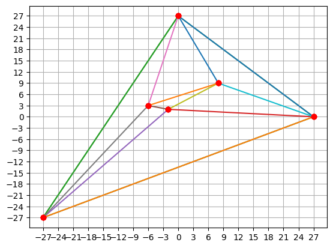
 |  | 
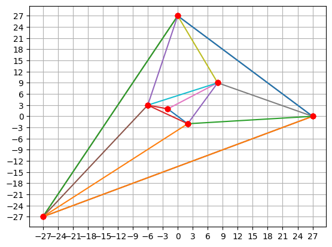 |  | 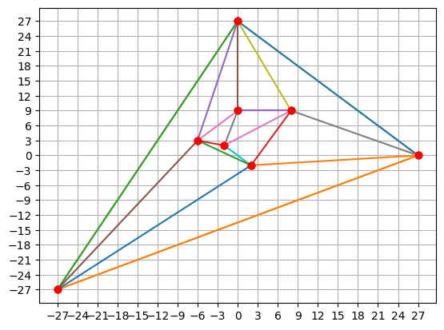
 |  | 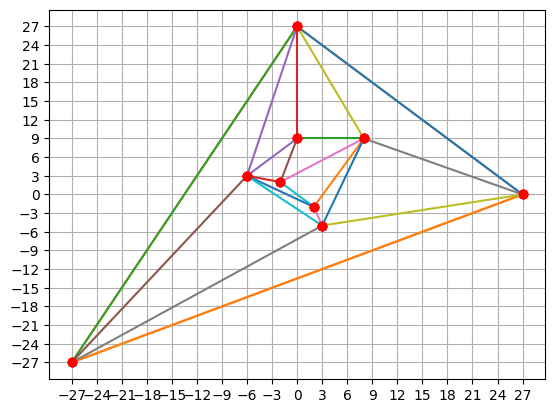
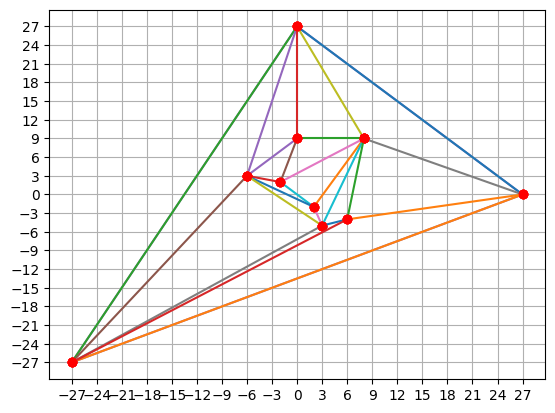 |  | 
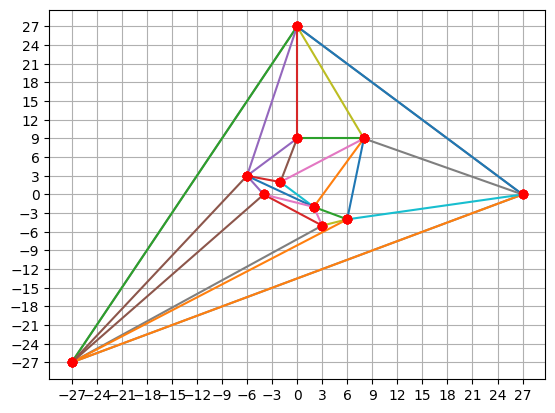 | 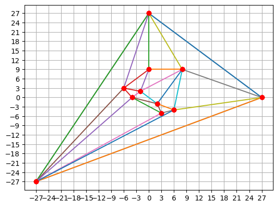 | 
 |  | 
 | 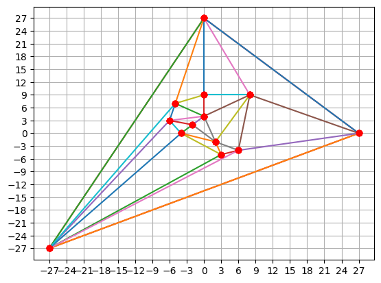 | 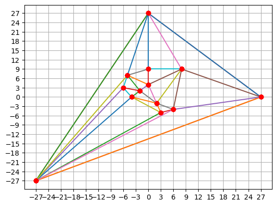
 | 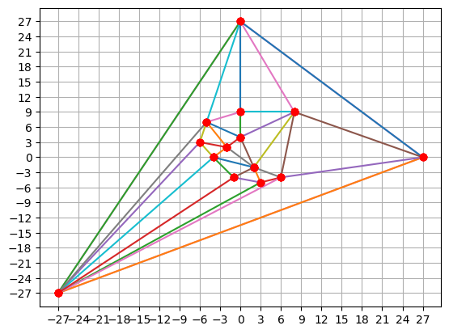 | 
 |  | 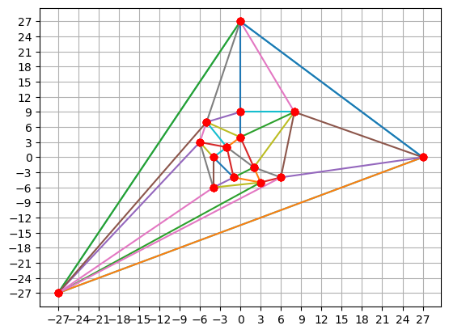
 | 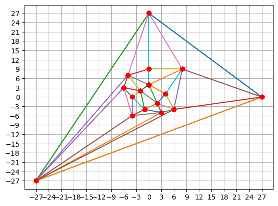 | 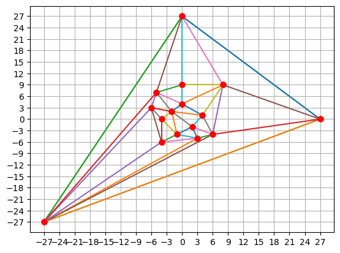
 | 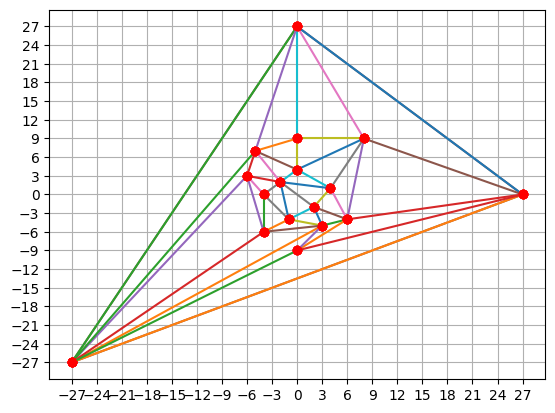 | 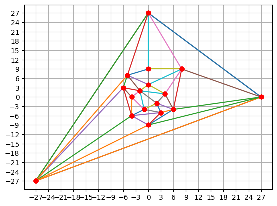
 |  | 
 | 

### Useful resources
- https://www.ti.inf.ethz.ch/ew/Lehre/CG13/lecture/Chapter%206.pdf
- https://www.sciencedirect.com/science/article/pii/030439759390024N
-  http://www.s-hull.org/paper/s_hull.pdf

#### TODO
- check for overflows & exceptions
- check colinear points
- improve data structure